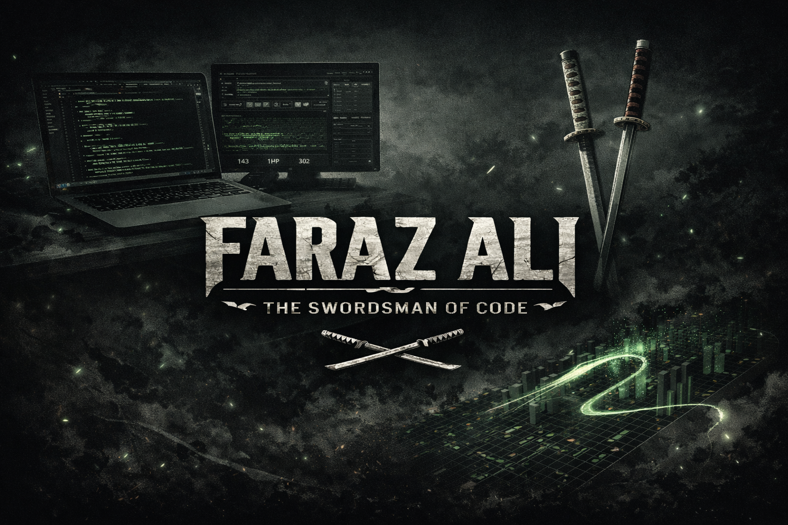
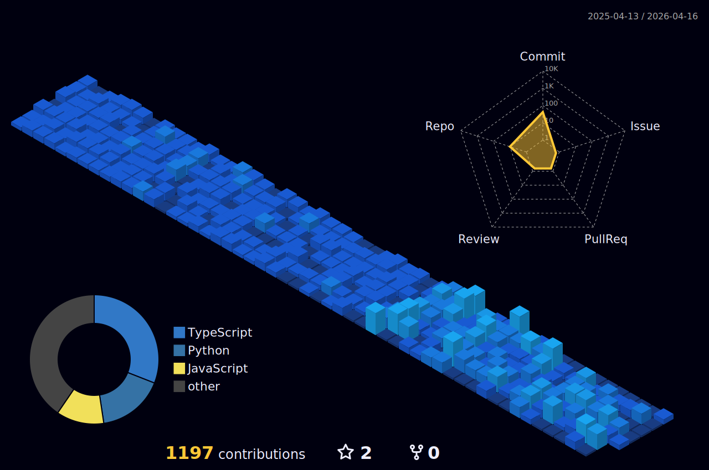

<!-- ================== ZORO MODE ================== -->

  

<h1 align="center">⚔️ FARAZ ALI</h1>

  <strong>Swordsman of Software • Founder • Silent Builder</strong>

  <em>“Scars on the back are a swordsman’s shame.”</em>

---

## ⚔️ 三刀流 (Three-Sword Style)

    |||||||||||||||
    ||  三刀流  ||
    |||||||||||||||

---

## 🩸 Code Is My Sword

I don’t over-explain.  
I don’t chase hype.  

I **train**,  
I **commit**,  
I **cut bugs cleanly**.

- Discipline > Motivation  
- Fundamentals > Frameworks  
- Shipping > Talking  

---

## 🗡️ Three-Sword Engineering Style

| Sword | Principle | In Practice |
|------|-----------|-------------|
| **Wado Ichimonji** | Purity | Clean Architecture, Types, Tests |
| **Sandai Kitetsu** | Risk | Performance, Systems, Scaling |
| **Yubashiri** | Flow | DX, Tooling, Automation |

---

## 🧠 Combat Stats

**Frontend**
██████████████░░░░ 85%
**Backend**
████████████████░░ 90%

markdown
Copy code

**System Design**
███████████████░░░ 88%

markdown
Copy code

**Discipline**
██████████████████ 100%

---

## 🏴‍☠️ Arsenal

  

---

## 📜 Training Log (GitHub)

  

  

---

## 🌑 Night Training Grounds

  

---

## 🐍 Endless Path

  

---

## 📡 Signals

  
  

---

  <strong>
    I don’t aim to be known. 
    I aim to be undeniable.
  </strong>

⚔️

  

